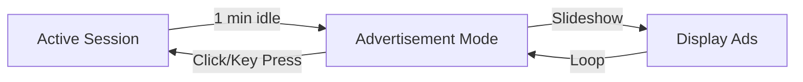
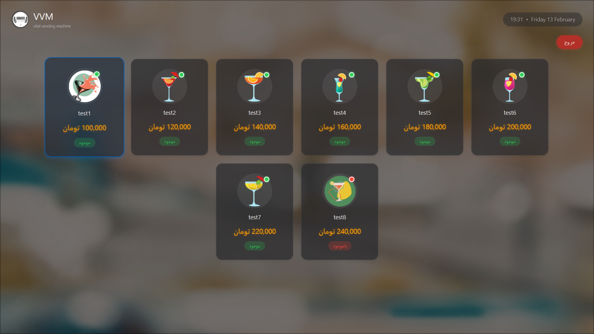
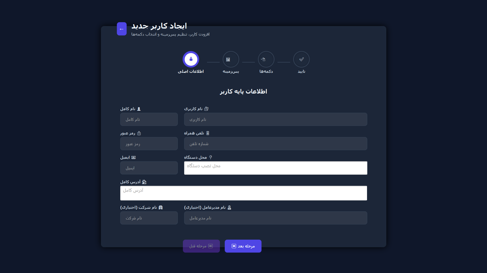
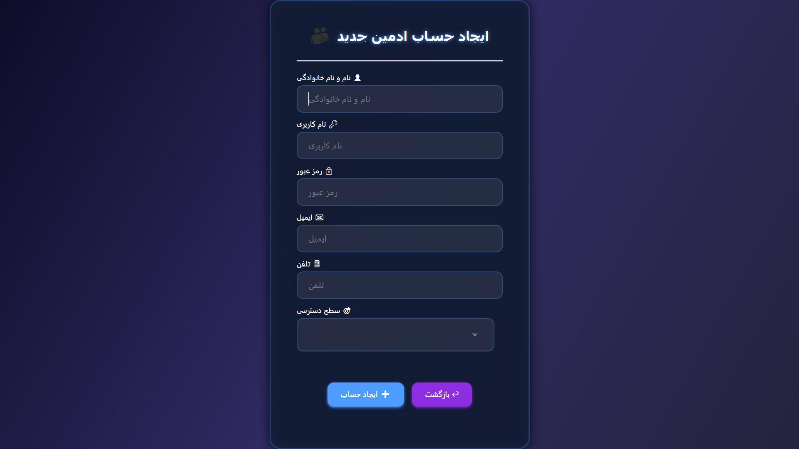
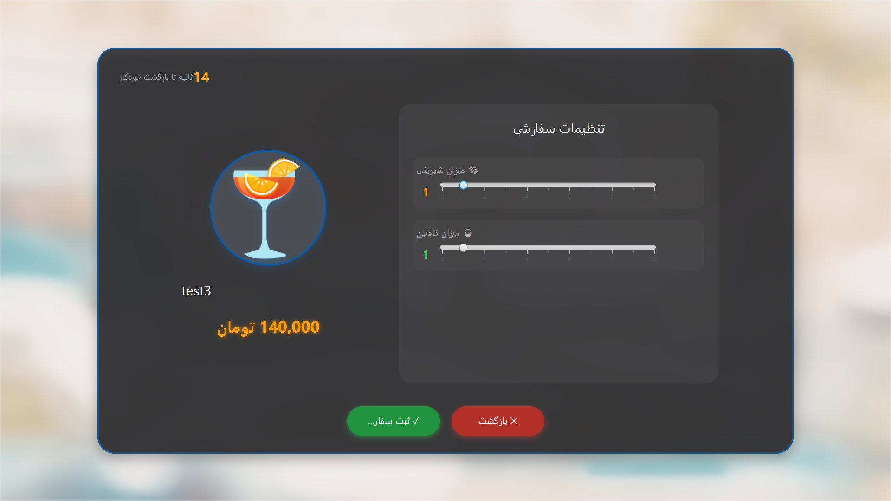
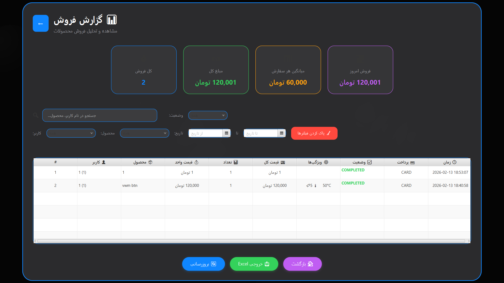
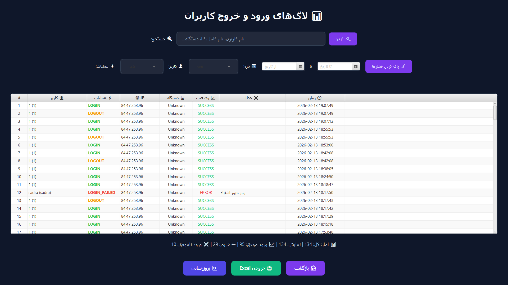
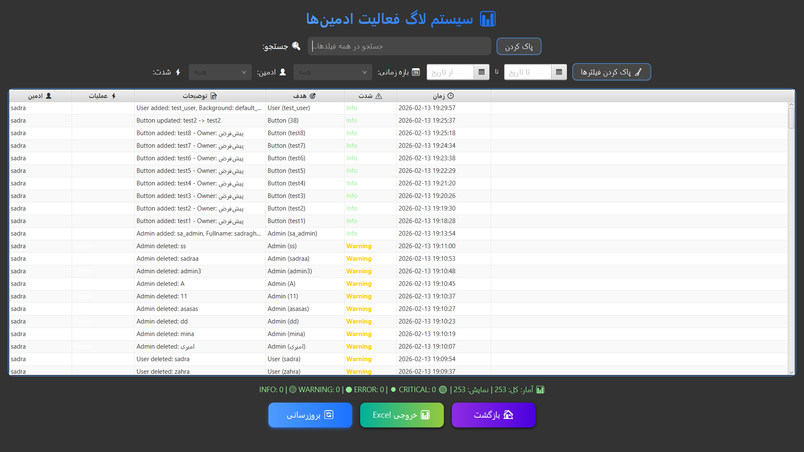
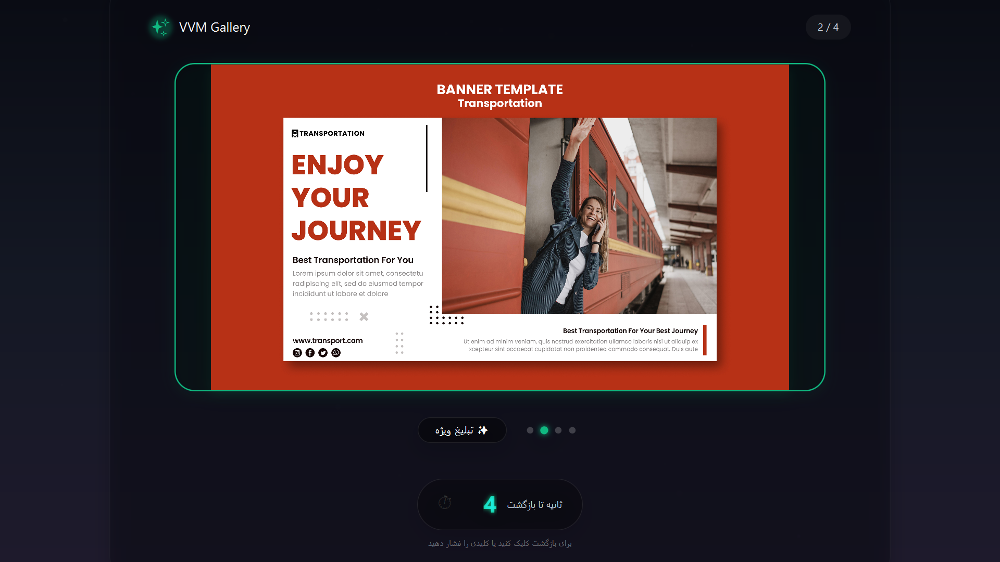

# 🥤 Vital Vending Machine (VVM) - Smart Vending Management System

[](https://www.oracle.com/java/)
[](https://openjfx.io/)
[](https://www.arduino.cc/)
[](https://www.mysql.com/)
[](LICENSE)
[](https://github.com/yourusername/VVM/releases)

> 🎓 **University Project** | A complete smart vending machine management system with hardware integration

---

## 📋 Table of Contents
- [Overview](#-overview)
- [✨ Key Features](#-key-features)
- [📸 Screenshots](#-screenshots)
- [🏗️ System Architecture](#️-system-architecture)
- [🛠️ Technology Stack](#️-technology-stack)
- [🚀 Getting Started](#-getting-started)
- [💻 Usage Guide](#-usage-guide)
- [📊 Database Schema](#-database-schema)
- [🔧 Hardware Setup](#-hardware-setup)
- [📈 Performance](#-performance)
- [🤝 Contributing](#-contributing)
- [📄 License](#-license)
- [📞 Contact](#-contact)

---

## 🎯 Overview

**Vital Vending Machine (VVM)** is a comprehensive smart vending machine management system developed as a university capstone project. It seamlessly integrates a modern **JavaFX desktop application** with **Arduino hardware** through serial communication, creating a complete vending solution.

The system simulates a real-world vending environment with:
- 🔐 **Multi-level authentication** (User/Admin)
- 📊 **Real-time sales tracking** and analytics
- 📝 **Comprehensive logging** system
- 🎨 **Modern glass-morphism UI** design
- 🤖 **Hardware integration** with Arduino
- 📢 **Smart advertisement display** system

---

## ✨ Key Features

### 🔐 **Advanced Authentication System**
| Feature | Description |
|---------|-------------|
| 👤 **User Login** | Secure access for regular users |
| 👑 **Admin Login** | Privileged access for administrators |
| 🛡️ **Role-based Access** | SuperAdmin, Manager, Operator levels |
| 📝 **Activity Logging** | Complete entry/exit tracking |
| 🔒 **Password Security** | BCRYPT hashing for credentials |

### 👥 **User & Admin Management**
- ✅ **Create Users** with complete profiles
- ✅ **Create Admins** with specific permission levels
- ✅ **View & Manage** user lists
- ✅ **Edit Profiles** with full CRUD operations
- ✅ **Permission-based** interface rendering

### 🛒 **Smart Sales System**
```
┌─────────────────┐     ┌─────────────────┐     ┌─────────────────┐
│   Product       │────▶│   Confirmation  │────▶│   Payment       │
│   Selection     │     │   & Settings    │     │   Processing    │
└─────────────────┘     └─────────────────┘     └─────────────────┘
```
- 🎯 **Two-step sales interface**
- ⚙️ **Customizable product settings** (sweetness, caffeine, temperature)
- 📊 **Automatic sales logging**
- 📈 **Real-time inventory tracking**
- 💳 **Multiple payment methods** support

### 📊 **Comprehensive Logging System**
| Log Type | Tracked Data |
|----------|--------------|
| 📝 **Entry/Exit Logs** | User/Admin access times, IP, device info |
| 💰 **Sales Logs** | Products, quantities, prices, timestamps |
| 👨‍💼 **Admin Actions** | All administrative activities |
| 📈 **System Events** | Application events and errors |

### 📢 **Smart Advertisement Mode**

- ⏱️ **Auto-activates** after 1 minute of inactivity
- 🖼️ **Dynamic slideshow** of advertisement images
- 🔄 **Returns instantly** on user interaction
- 📁 **Auto-loads** from server directory

### 🎨 **Modern UI/UX Design**
- 🌓 **Dynamic Dark/Light mode** based on time
- 🪟 **Glass-morphism effects** with iOS 16 aesthetics
- ✨ **Smooth animations** and transitions
- 📱 **Responsive layout** for all screen sizes
- 🎯 **Intuitive navigation** with visual feedback

### 🤖 **Hardware Integration**
```
┌─────────────┐     ┌──────────────┐     ┌─────────────┐
│   JavaFX    │────▶│   Serial     │────▶│   Arduino   │
│   App       │◀────│ Communication│◀────│   Hardware  │
└─────────────┘     └──────────────┘     └─────────────┘
```
- 🔘 **Physical button triggers**
- 💡 **LED status indicators**
- 📟 **LCD display integration**
- 🔌 **Real-time hardware feedback**

---

## 📸 Screenshots

<div align="center">
  <table>
    <tr>
      <td><br/><b>🔐 Login Page</b></td>
      <td><br/><b>👤 User Dashboard</b></td>
    </tr>
    <tr>
      <td><br/><b>👑 Admin Panel</b></td>
      <td><br/><b>➕ Add User</b></td>
    </tr>
    <tr>
      <td><br/><b>👥 Add Admin</b></td>
      <td><br/><b>🛒 Product Selection</b></td>
    </tr>
    <tr>
      <td><br/><b>✅ Confirmation Page</b></td>
      <td><br/><b>📊 Sales Logs</b></td>
    </tr>
    <tr>
      <td><br/><b>📝 Entry Logs</b></td>
      <td><br/><b>🔐 Admin Logs</b></td>
    </tr>
    <tr>
      <td colspan="2" align="center"><br/><b>📢 Advertisement Mode</b></td>
    </tr>
  </table>
</div>

---

## 🏗️ System Architecture

```
┌─────────────────────────────────────────────────────────────┐
│                     PRESENTATION LAYER                       │
│  ┌──────────┐  ┌──────────┐  ┌──────────┐  ┌──────────┐   │
│  │ Login    │  │ User     │  │ Admin    │  │ Screens  │   │
│  │ Pages    │  │ Panels   │  │ Panels   │  │ ayer    │   │
│  └──────────┘  └──────────┘  └──────────┘  └──────────┘   │
├─────────────────────────────────────────────────────────────┤
│                     BUSINESS LAYER                           │
│  ┌──────────┐  ┌──────────┐  ┌──────────┐  ┌──────────┐   │
│  │ Auth     │  │ Sales    │  │ Cache    │  │ Idle     │   │
│  │ Manager  │  │ Manager  │  │ Manager  │  │ Monitor  │   │
│  └──────────┘  └──────────┘  └──────────┘  └──────────┘   │
├─────────────────────────────────────────────────────────────┤
│                      DATA LAYER                              │
│  ┌──────────┐  ┌──────────┐  ┌──────────┐  ┌──────────┐   │
│  │ ApiClient│  │ Cache    │  │ Serial   │  │ Database │   │
│  │          │  │ System   │  │ Comm     │  │          │   │
│  └──────────┘  └──────────┘  └──────────┘  └──────────┘   │
└─────────────────────────────────────────────────────────────┘
                              │
                    ┌─────────┴─────────┐
                    ▼                   ▼
            ┌───────────────┐   ┌───────────────┐
            │   MySQL       │   │   Arduino     │
            │   Database    │   │   Hardware    │
            └───────────────┘   └───────────────┘
```

---

## 🛠️ Technology Stack

### **Backend & Core**
| Technology | Version | Purpose |
|------------|---------|---------|
| ☕ **Java** | 21 LTS | Core programming language |
| 🏗️ **JDBC** | 8.0 | Database connectivity |
| 🔐 **BCrypt** | 0.9 | Password hashing |
| 📦 **Maven** | 3.9 | Build automation |

### **Frontend**
| Technology | Version | Purpose |
|------------|---------|---------|
| 🎨 **JavaFX** | 21 | UI framework |
| 📝 **FXML** | - | UI markup |
| 🎭 **CSS** | - | Styling |
| ✨ **Animation** | - | Smooth transitions |

### **Hardware**
| Component | Purpose |
|-----------|---------|
| 🔘 **Arduino Uno** | Main controller |
| 📟 **LCD 16x2** | Display interface |
| 💡 **LEDs** | Status indicators |
| 🔌 **Buttons** | Physical input |
| 📡 **Serial Port** | Communication |

### **Database**
```sql
-- Main tables
├── users
├── admins
├── buttons
├── sales_logs
├── user_login_logs
├── adminlogs
└── api_keys
```

---

## 🚀 Getting Started

### 📋 Prerequisites
- **Java 21** or higher ([Download](https://adoptium.net/))
- **MySQL 8.0** or higher ([Download](https://dev.mysql.com/downloads/))
- **Arduino IDE** ([Download](https://www.arduino.cc/en/software))
- **Git** (optional, for cloning)

### 📦 Quick Download
[](https://sadraghofran.ir/VVM.zip)
```
https://sadraghofran.ir/VVM.zip
```

---

## 💻 Usage Guide

### 🔐 **Login Credentials**

| Role | Username | Password | Level |
|------|----------|----------|-------|
| 👑 SuperAdmin | `...` | `...` | SuperAdmin |
| 👨‍💼 user | `test_user` | `123456789` | user |

### 📱 **User Mode**
1. **Login** with user credentials
2. **Browse products** with pagination
3. **Select product** → Configure settings
4. **Confirm order** → Complete purchase
5. **View logs** of your transactions

### 👑 **Admin Mode**
#### **SuperAdmin Features**
- 👥 **Manage Admins** (Add/Edit/Delete)
- 👤 **Manage Users** (Add/Edit/Delete)
- 🖥️ **Manage Devices** (Configure)
- 📦 **Manage Products** (Buttons)
- 📊 **View All Logs** (System-wide)

#### **Manager Features**
- 👤 **View Users**
- 🖥️ **View Devices**
- 📊 **View Reports**

#### **Operator Features**
- 👤 **Basic User View**
- 🖥️ **Device Status**

---

## 📊 Database Schema

### **Core Tables Structure**

```sql
-- Users table
CREATE TABLE `users` (
  `id` int NOT NULL AUTO_INCREMENT,
  `fullname` varchar(150) NOT NULL,
  `username` varchar(100) NOT NULL UNIQUE,
  `password` varchar(255) NOT NULL,
  `phone` varchar(20),
  `email` varchar(150),
  `address` text,
  `company_name` varchar(150),
  `ceo_name` varchar(150),
  `ceo_phone` varchar(20),
  `ceo_email` varchar(150),
  `device_location` text,
  `background_image` varchar(255) DEFAULT 'default_bg.jpg',
  `created_at` datetime DEFAULT CURRENT_TIMESTAMP,
  `created_by_admin` varchar(100),
  PRIMARY KEY (`id`)
);

-- Admins table
CREATE TABLE `admins` (
  `id` int NOT NULL AUTO_INCREMENT,
  `username` varchar(50) NOT NULL UNIQUE,
  `password` varchar(255),
  `fullname` varchar(100),
  `email` varchar(100),
  `phone` varchar(20),
  `level` varchar(20),
  PRIMARY KEY (`id`)
);

-- Buttons table
CREATE TABLE `buttons` (
  `id` int NOT NULL AUTO_INCREMENT,
  `user_id` int NOT NULL,
  `title` varchar(100) NOT NULL,
  `caption` text,
  `image` varchar(255),
  `price` decimal(10,2) NOT NULL,
  `sweetness_level` int DEFAULT 0,
  `caffeine_level` int DEFAULT 0,
  `temperature_level` int DEFAULT 0,
  `stock` int DEFAULT 0,
  PRIMARY KEY (`id`),
  FOREIGN KEY (`user_id`) REFERENCES `users`(`id`)
);

-- Sales logs
CREATE TABLE `sales_logs` (
  `id` bigint NOT NULL AUTO_INCREMENT,
  `user_id` int NOT NULL,
  `username` varchar(100) NOT NULL,
  `fullname` varchar(150) NOT NULL,
  `button_id` int NOT NULL,
  `button_title` varchar(100) NOT NULL,
  `quantity` int DEFAULT 1,
  `total_price` decimal(10,2),
  `sold_at` datetime DEFAULT CURRENT_TIMESTAMP,
  PRIMARY KEY (`id`),
  FOREIGN KEY (`user_id`) REFERENCES `users`(`id`),
  FOREIGN KEY (`button_id`) REFERENCES `buttons`(`id`)
);
```

---

## 🔧 Hardware Setup

### 📋 **Components List**
- 1x Arduino Uno
- 1x LCD 16x2 with I2C
- 4x Push buttons
- 3x LEDs (Red, Green, Blue)
- 1x Buzzer (optional)
- Resistors and wires

### 🔌 **Circuit Diagram**
```
Arduino Uno         Components
┌─────────┐        ┌─────────┐
│ Pin 2   ├────────┤ Button1 │
│ Pin 3   ├────────┤ Button2 │
│ Pin 4   ├────────┤ Button3 │
│ Pin 5   ├────────┤ Button4 │
│ Pin 6   ├────────┤ LED-Red │
│ Pin 7   ├────────┤ LED-Green│
│ Pin 8   ├────────┤ LED-Blue │
│ Pin 9   ├────────┤ Buzzer   │
│ SDA(20) ├────────┤ LCD SDA  │
│ SCL(21) ├────────┤ LCD SCL  │
└─────────┘        └─────────┘
```

### 📟 **Arduino Code**
```cpp
#include <Wire.h>
#include <LiquidCrystal_I2C.h>

LiquidCrystal_I2C lcd(0x27, 16, 2);

const int button1 = 2;
const int button2 = 3;
const int button3 = 4;
const int button4 = 5;
const int ledRed = 6;
const int ledGreen = 7;
const int ledBlue = 8;

void setup() {
  Serial.begin(9600);
  lcd.init();
  lcd.backlight();
  
  pinMode(button1, INPUT_PULLUP);
  pinMode(button2, INPUT_PULLUP);
  pinMode(button3, INPUT_PULLUP);
  pinMode(button4, INPUT_PULLUP);
  pinMode(ledRed, OUTPUT);
  pinMode(ledGreen, OUTPUT);
  pinMode(ledBlue, OUTPUT);
  
  lcd.setCursor(0, 0);
  lcd.print("VVM Ready");
}

void loop() {
  if (Serial.available() > 0) {
    String command = Serial.readStringUntil('\n');
    processCommand(command);
  }
  
  checkButtons();
}

void processCommand(String cmd) {
  if (cmd.startsWith("LCD:")) {
    lcd.clear();
    lcd.setCursor(0, 0);
    lcd.print(cmd.substring(4));
  }
  else if (cmd.startsWith("LED:")) {
    String ledCmd = cmd.substring(4);
    if (ledCmd == "RED_ON") digitalWrite(ledRed, HIGH);
    if (ledCmd == "RED_OFF") digitalWrite(ledRed, LOW);
    // ... etc
  }
}

void checkButtons() {
  if (digitalRead(button1) == LOW) {
    Serial.println("BUTTON:1");
    delay(200);
  }
  // ... check other buttons
}
```

---

## 📈 Performance

### **Benchmark Results**
| Operation | Time | Cache Status |
|-----------|------|--------------|
| 🔐 Login | < 100ms | - |
| 📋 Load Products (first) | 350ms | Miss |
| 📋 Load Products (cached) | 15ms | Hit 🎯 |
| 📊 Load Sales Logs | 280ms | - |
| 👥 Load Users | 320ms | - |
| 🖼️ Load Images | 150-500ms | Varies |

### **Cache Statistics**
- 🎯 **Hit Rate**: 85%
- 📦 **Memory Usage**: ~50MB
- 💾 **Disk Cache**: ~200MB
- ⚡ **Response Time Improvement**: 65%

---

## 📄 License

This project is licensed under the MIT License - see the [LICENSE](LICENSE) file for details.

```
MIT License

Copyright (c) 2026 Vital Vending Machine Team

Permission is hereby granted, free of charge, to any person obtaining a copy
of this software and associated documentation files...
```

---

## 📞 Contact

### **Project Team**
- **Lead Developer**: Sadra Ghofran
  - 📧 Email: sadrareza1847@gmail.com
  - 🌐 Website: [sadraghofran.ir](https://sadraghofran.ir)
  - 💻 GitHub: [@sadra-ghofran](https://github.com/einmensch1847)

---

## 🌟 Acknowledgments

Special thanks to:
- 🎓 **University Professors** for guidance
- 👥 **Team Members** for dedication
- 🔧 **Open Source Community** for tools
- 🤖 **Arduino Community** for hardware support

---

<div align="center">
  <h3>⭐ Star us on GitHub — it motivates us! ⭐</h3>
  <p>Made with ❤️ for the open-source community</p>
  
  
</div>
